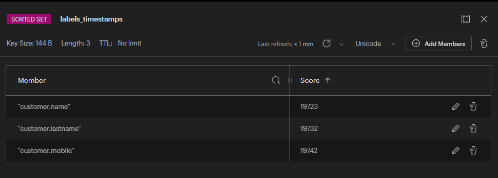
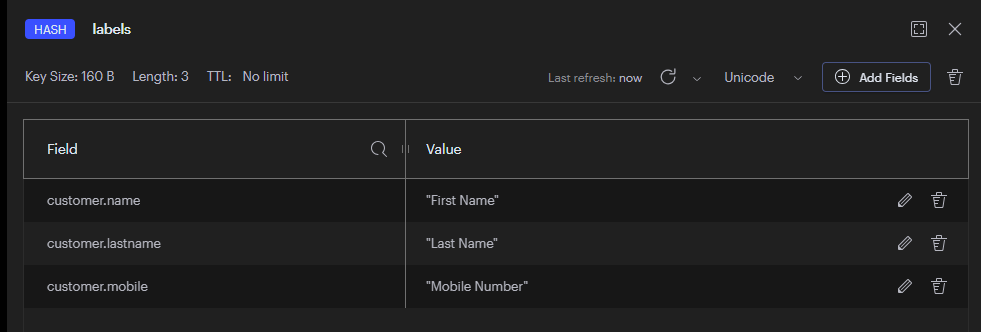

## Redis Timeseries 
- This is a sample implementation of timeseries data with Redis, without using the `timeseries module`
- It uses sorted sets and hash to implement the logic

### Data loading
- Refer to class `RedisTimeseriesApplication` for loading labels data

### Redis Data

#### Sorted Set


#### Hash Data



### Curl requests

```bash
curl --location 'http://localhost:8080/v1/api/labels/changes?since=2024-01-01'
```

```bash
curl --location 'http://localhost:8080/v1/api/labels/changes?since=2024-01-10'
```
```bash
curl --location 'http://localhost:8080/v1/api/labels/changes?since=2024-01-20'
```

```
GET http://localhost:8080/v1/api/labels/changes?since=2024-01-01
200
13 ms
GET /v1/api/labels/changes?since=2024-01-01 HTTP/1.1
User-Agent: PostmanRuntime/7.37.0
Accept: */*
Postman-Token: adc1cf61-27e3-4df1-af34-4297f4855987
Host: localhost:8080
Accept-Encoding: gzip, deflate, br
Connection: keep-alive
 
HTTP/1.1 200 OK
Content-Type: application/json
Transfer-Encoding: chunked
Date: Wed, 03 Apr 2024 04:38:19 GMT
Keep-Alive: timeout=60
Connection: keep-alive
 
{"customer.lastname":"Last Name","customer.mobile":"Mobile Number","customer.name":"First Name"}
```

```bash
GET http://localhost:8080/v1/api/labels/changes?since=2024-01-10
200
18 ms
GET /v1/api/labels/changes?since=2024-01-10 HTTP/1.1
User-Agent: PostmanRuntime/7.37.0
Accept: */*
Postman-Token: ddb8de45-5a1c-4a08-9cc7-8eaa9afb157a
Host: localhost:8080
Accept-Encoding: gzip, deflate, br
Connection: keep-alive
 
HTTP/1.1 200 OK
Content-Type: application/json
Transfer-Encoding: chunked
Date: Wed, 03 Apr 2024 04:41:10 GMT
Keep-Alive: timeout=60
Connection: keep-alive
 
{"customer.lastname":"Last Name","customer.mobile":"Mobile Number"}
```